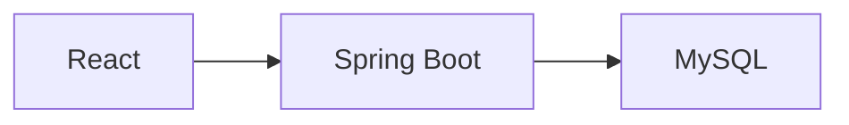

# Restaurant Menu


Aplicação full-stack para gerenciamento de cardápios digitais com painel administrativo e API REST.


## Visão Geral

O projeto permite cadastrar, editar, remover e visualizar itens do cardápio por meio de uma interface web integrada a uma API REST.

A aplicação foi desenvolvida utilizando arquitetura desacoplada entre frontend e backend, com persistência em banco relacional e execução via containers Docker.

## Funcionalidades

- Gerenciamento de itens do cardápio
- Cadastro, edição e exclusão (CRUD)
- Painel administrativo
- API REST documentada
- Interface responsiva
- Execução containerizada

---

## Capturas de Tela

<table align="center">
<tr>

<td align="center">

**Página Inicial**


</td>

<td align="center">

**Painel Administrativo**


</td>

</tr>

<tr>

<td align="center">

**Adicionar Item**


</td>

<td align="center">

**Editar Item**


</td>

</tr>
</table>

---

## Arquitetura



---

## Stack Tecnológica

| Camada | Tecnologia |
|---|---|
| Backend | Spring Boot + JPA |
| Frontend | React |
| Banco de Dados | MySQL |
| Documentação | OpenAPI / Swagger |
| Testes | JUnit |
| Infraestrutura | Docker |

---

## Documentação da API

Swagger disponível em:

```txt
http://localhost:8080/swagger-ui.html
```


---

## Executando o Projeto

### Pré-requisitos

- Docker

### Inicialização

```bash
docker compose up --build
```

---

## Serviços

| Serviço | URL |
|---|---|
| Frontend | http://localhost |
| Backend | http://localhost:8080 |
| Swagger | http://localhost:8080/swagger-ui.html |

---

## Roadmap

- [x] CRUD de cardápio
- [x] Painel administrativo
- [x] API documentada
- [ ] Autenticação
- [ ] Upload de imagens
- [ ] Deploy automatizado

---

## Licença

Distribuído sob licença MIT.
